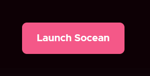
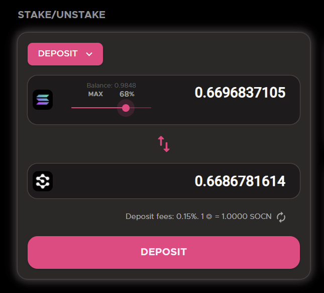
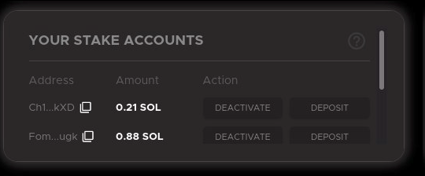
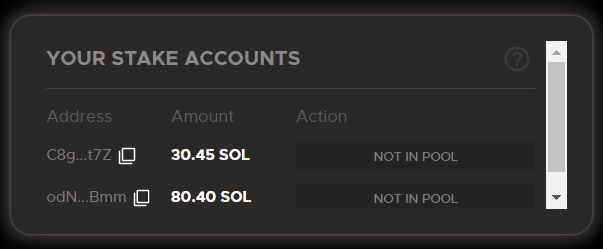
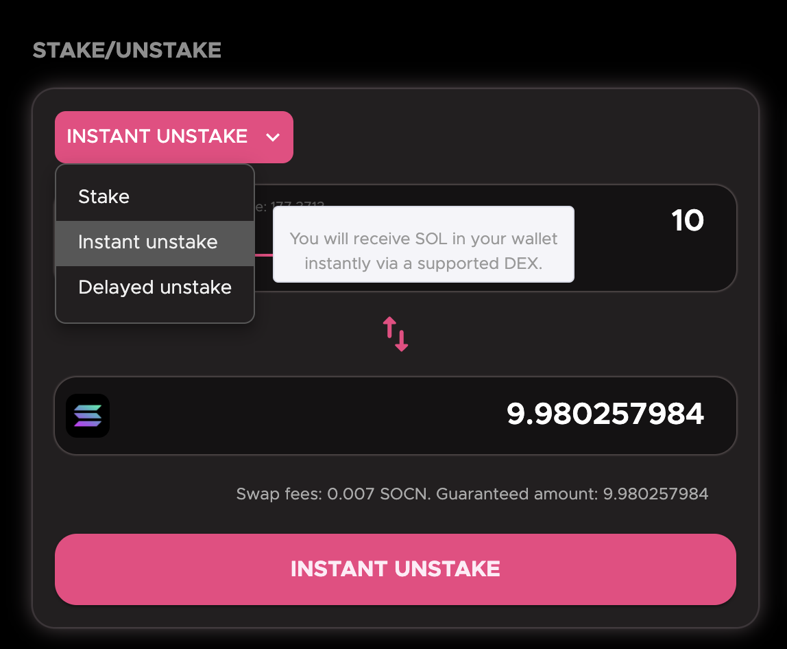
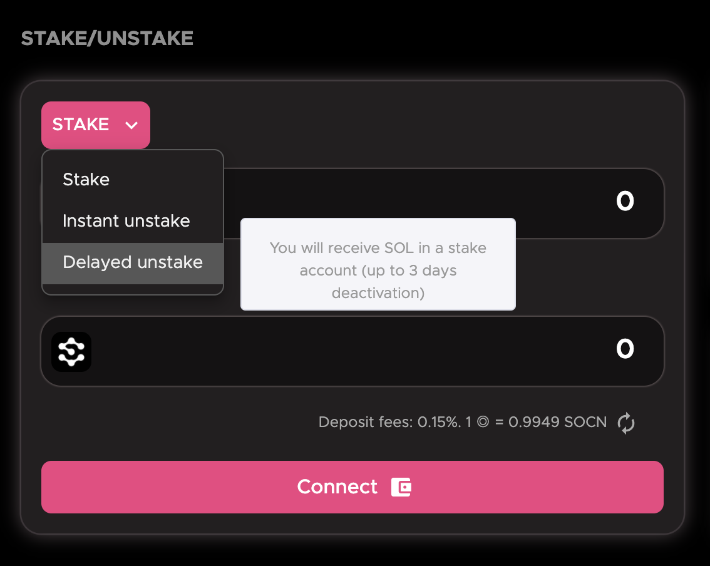
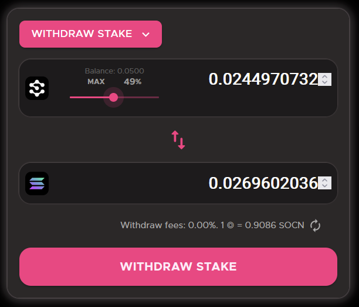
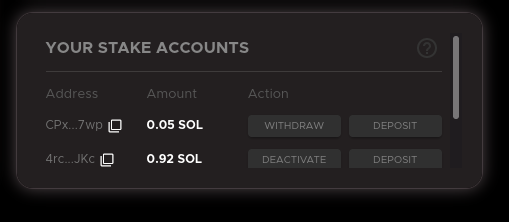

# 通过Socean质押

## 直接存入◎SOL

直接存入◎SOL是最简单的方式。

这里是过程动图：


存入SOL


点击Launch Socean

点击Connect连接您的钱包


我们目前只支持Sollet和Phantom。更多的钱包支持即将推出！


连接钱包后，Stake/Unstake交互界面将被激活。选择您想要存入的SOL数量然后点击Desposit按钮：

大功告成！现在您的钱包里有了$SOCN，它将会随着时间增值，也可以随时换成SOL。

## 用SOL和USDC换取scnSOL

除了直接存入，您也可以选择在流动池中交换。我们近期会与若干流动性提供者进行整合。

## 从活跃质押账户存入（高级）

您可以使用质押池命令行工具将激活的质押账户直接合并至Socean质押池中。如果您在我们所选择的验证节点上存有份额，您不必取消质押。您可以直接将您的SOL存入池中，而无需等待！

点击Deposit立马获得SOCN代币，或者Deactivate来取消SOL质押。

如果质押在了非我们选择的验证节点上，您需要首先取消质押，才能存入池中。

## 取出SOL

### 即时取消质押

您可以随时取出**未质押的**SOL。


目前，即时取消质押功能由第三方去中心化交易所（Orca）提供支持。


首先，连接您的钱包。然后在Stake/Unstake交互界面中选择Instant unstake：

授权钱包中的交易，您将立即获得SOL。

### 延时取消质押

您可以随时以质押账户的形式提取**已质押的**SOL。


取出过的质押账户中SOL仍质押于验证节点。因此，它们受到Solana的<mark style="color:blue;">质押冷却限制</mark>，并且**只能在至少一个纪元后才能作为完全流通的SOL取出。**


首先，连接您的钱包。然后在Stake/Unstake交互界面中选择Delayed unstake：

选择您需要取出的SOL数量：

授权交易后，您可以即时看到质押账户中的SOL（它们不再在SOCN的质押池中）。

这里是流程动图：



如果质押账户处于**活跃状态**，您可以点击Deactivate来反激活其中的SOL。这时质押账户会进入**未激活**状态。一旦质押账户在下个纪元或之后完全反激活，您就可以取出解锁的SOL。

这里是流程动图：



**激活**或**未激活**状态下的质押账户唯一可行的操作是取消激活或反激活。

否则，如果质押账户**非活跃**，您可以点击Withdraw直接取出SOL。

这里是流程动图：



如果钱包支持（如Phatom、Solflare），您也可以用它们来管理质押账户。
