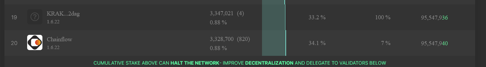

# 写给验证者

## 我是一名验证者。怎样才能通过Socean获得质押？

从Socean获得质押的最佳（也是唯一！）方式是运行一个既不在最小安全组也不在最小安全数据中心组的高性能节点。

目前，拥有大于**～330万**活跃质押的验证节点在最小安全组中。

属于16509-IE-Dublin, 16509-JP-Tokyo或者24940-DE-Falkenstein的验证者在最小安全数据中心组中。我们不会质押到里面的任意验证节点。

## 自身质押要求

验证者自身需要至少质押100个SOL。这意味着必须至少有一个完全激活的包含100SOL的质押账户，该账户与验证者的投票账户有同等的取出权限。不符合此标准的验证节点将立马被Socean池取消质押。用于满足自身要求的质押可以与用于满足Solana基金会要求的部分重叠。自身质押要求可能会随着时间的推移增加或减少（有充分的警告）。

除此之外，对验证者没有任何要求。如果您的节点表现良好并符合标准，您将获得质押。

